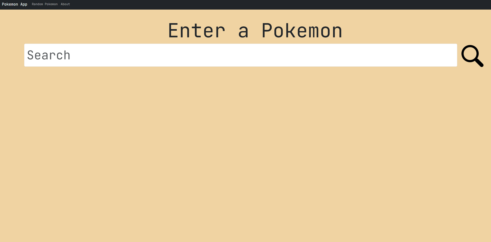
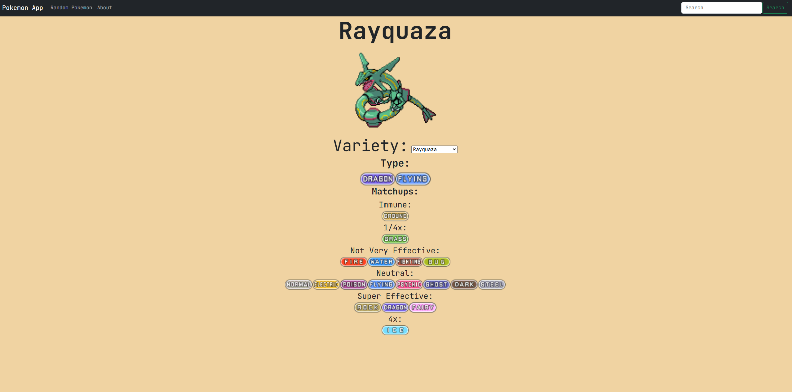

# Pokemon Matchup Calculator
**Developed by Owen Treanor**

## Overview
A Pokemon search website that displays info about any Pokemon including that Pokemon's type matchups.

## Features
- Look up any Pokemon and receive an image, type, and type matchups for it.
- Ability to change the Pokemon's form.
- Real-time search suggestions.
- Search for a random Pokemon.

## Installation
1. Clone the repo.
2. Make sure you have Python installed.
3. Install dependencies (pip install -r requirements.txt).
4. Run the app (flask run).
5. Use a web browser to search the link that Step 4 provides.

## Deployment
https://pokemon-matchup-calculator-cabc7c459e06.herokuapp.com/

## Technologies Used
- Python (Flask)
- HTML, CSS, JS
- SQLAlchemy
- PokeAPI

## Screenshots

## License
- This project is licensed under the MIT License.
